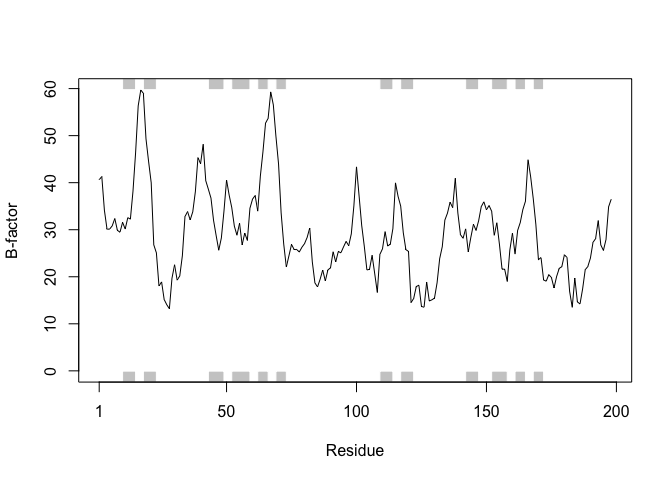

Class 11: Structural Bioinformatics
================

The PDB database
----------------

The [PDB](http://www.rcsb.org/) is the main repository for biomolecular structure data.

Here we examine the contents of the PDB:

Q1: Download a CSV file from the PDB site (accessible from “Analyze” -&gt; “PDB Statistics” &gt; “by Experimental Method and Molecular Type”. Move this CSV file into your RStudio project and determine the percentage of structures solved by X-Ray and Electron Microscopy. From the website what proportion of structures are protein? Aim to have a rendered GitHub document with working code that yields your answers.

``` r
db <- read.csv("Data Export Summary.csv", row.names=1)
head(db)
```

    ##                     Proteins Nucleic.Acids Protein.NA.Complex Other  Total
    ## X-Ray                 126880          2012               6547     8 135447
    ## NMR                    11062          1279                259     8  12608
    ## Electron Microscopy     2277            31                800     0   3108
    ## Other                    256             4                  6    13    279
    ## Multi Method             129             5                  2     1    137

How many are X-ray?

``` r
(db$Total[1]/sum(db$Total)) * 100
```

    ## [1] 89.35736

How many are protein structures?

``` r
(sum(db$Proteins)/sum(db$Total)) * 100
```

    ## [1] 92.75955

We could also try the datapasta package and copy from website and "Addins" &gt; Paste as data.frame ...

``` r
library(datapasta)

data.frame(stringsAsFactors=FALSE,
   Experimental.Method = c("X-Ray", "Other", "NMR", "Multi Method",
                           "Electron Microscopy", "Total"),
              Proteins = c(126880, 256, 11062, 129, 2277, 140604),
         Nucleic.Acids = c(2012, 4, 1279, 5, 31, 3331),
    Protein.NA.Complex = c(6547, 6, 259, 2, 800, 7614),
                 Other = c(8, 13, 8, 1, 0, 30),
                 Total = c(135447, 279, 12608, 137, 3108, 151579)
)
```

    ##   Experimental.Method Proteins Nucleic.Acids Protein.NA.Complex Other
    ## 1               X-Ray   126880          2012               6547     8
    ## 2               Other      256             4                  6    13
    ## 3                 NMR    11062          1279                259     8
    ## 4        Multi Method      129             5                  2     1
    ## 5 Electron Microscopy     2277            31                800     0
    ## 6               Total   140604          3331               7614    30
    ##    Total
    ## 1 135447
    ## 2    279
    ## 3  12608
    ## 4    137
    ## 5   3108
    ## 6 151579

Q2: Type HIV in the PDB website search box on the home page and determine how many HIV-1 protease structures are in the current PDB?

There are 1157 as of 2019-05-07 See: <http://www.rcsb.org/pdb/results/results.do?tabtoshow=Current&qrid=5C35D458>

Section 3 Using Bio3D
---------------------

``` r
library(bio3d)
```

``` r
pdb <- read.pdb("1hsg")
```

    ##   Note: Accessing on-line PDB file

``` r
pdb
```

    ## 
    ##  Call:  read.pdb(file = "1hsg")
    ## 
    ##    Total Models#: 1
    ##      Total Atoms#: 1686,  XYZs#: 5058  Chains#: 2  (values: A B)
    ## 
    ##      Protein Atoms#: 1514  (residues/Calpha atoms#: 198)
    ##      Nucleic acid Atoms#: 0  (residues/phosphate atoms#: 0)
    ## 
    ##      Non-protein/nucleic Atoms#: 172  (residues: 128)
    ##      Non-protein/nucleic resid values: [ HOH (127), MK1 (1) ]
    ## 
    ##    Protein sequence:
    ##       PQITLWQRPLVTIKIGGQLKEALLDTGADDTVLEEMSLPGRWKPKMIGGIGGFIKVRQYD
    ##       QILIEICGHKAIGTVLVGPTPVNIIGRNLLTQIGCTLNFPQITLWQRPLVTIKIGGQLKE
    ##       ALLDTGADDTVLEEMSLPGRWKPKMIGGIGGFIKVRQYDQILIEICGHKAIGTVLVGPTP
    ##       VNIIGRNLLTQIGCTLNF
    ## 
    ## + attr: atom, xyz, seqres, helix, sheet,
    ##         calpha, remark, call

Q6. How many amino acid residues are there in this pdb object and what are the two non- protein residues?

There are 198 amino acids. The two non-protein residues are HOH (127) and MK1 (1)

``` r
attributes(pdb)
```

    ## $names
    ## [1] "atom"   "xyz"    "seqres" "helix"  "sheet"  "calpha" "remark" "call"  
    ## 
    ## $class
    ## [1] "pdb" "sse"

``` r
head(pdb$atom)
```

    ##   type eleno elety  alt resid chain resno insert      x      y     z o
    ## 1 ATOM     1     N <NA>   PRO     A     1   <NA> 29.361 39.686 5.862 1
    ## 2 ATOM     2    CA <NA>   PRO     A     1   <NA> 30.307 38.663 5.319 1
    ## 3 ATOM     3     C <NA>   PRO     A     1   <NA> 29.760 38.071 4.022 1
    ## 4 ATOM     4     O <NA>   PRO     A     1   <NA> 28.600 38.302 3.676 1
    ## 5 ATOM     5    CB <NA>   PRO     A     1   <NA> 30.508 37.541 6.342 1
    ## 6 ATOM     6    CG <NA>   PRO     A     1   <NA> 29.296 37.591 7.162 1
    ##       b segid elesy charge
    ## 1 38.10  <NA>     N   <NA>
    ## 2 40.62  <NA>     C   <NA>
    ## 3 42.64  <NA>     C   <NA>
    ## 4 43.40  <NA>     O   <NA>
    ## 5 37.87  <NA>     C   <NA>
    ## 6 38.40  <NA>     C   <NA>

``` r
pdb$atom[1:2, c("eleno", "elety", "x", "y", "z")]
```

    ##   eleno elety      x      y     z
    ## 1     1     N 29.361 39.686 5.862
    ## 2     2    CA 30.307 38.663 5.319

``` r
pdb$atom$elety[1:2]
```

    ## [1] "N"  "CA"

``` r
plot.bio3d(pdb$atom$b[pdb$calpha], sse=pdb, typ="l", ylab=
            "B-factor")
```



Q7. What type of R object is ? HINT: You can always use the str() function to get a useful summery of any R object.

``` r
pdb$xyz
```

    ## 
    ##    Total Frames#: 1
    ##    Total XYZs#:   5058,  (Atoms#:  1686)
    ## 
    ##     [1]  29.361  39.686  5.862  <...>  30.112  17.912  -4.791  [5058] 
    ## 
    ## + attr: Matrix DIM = 1 x 5058

``` r
dim(pdb$xyz)
```

    ## [1]    1 5058

``` r
pdb$xyz[ 1, atom2xyz(1:2) ]
```

    ## [1] 29.361 39.686  5.862 30.307 38.663  5.319

### Atom Selection

``` r
ca.inds <- atom.select(pdb, "calpha")
ca.inds
```

    ## 
    ##  Call:  atom.select.pdb(pdb = pdb, string = "calpha")
    ## 
    ##    Atom Indices#: 198  ($atom)
    ##    XYZ  Indices#: 594  ($xyz)
    ## 
    ## + attr: atom, xyz, call

``` r
prot.pdb <- atom.select(pdb, "protein", value=TRUE)
write.pdb(prot.pdb, file="1hsg_protein.pdb")
```

``` r
lig.pdb <- atom.select(pdb, "ligand", value=TRUE)
write.pdb(prot.pdb, file="1hsg_ligand.pdb")
```

Section 5: Example Application on Adenylate Kinase (Adk)

``` r
aa <- get.seq("1ake_A")
```

    ## Warning in get.seq("1ake_A"): Removing existing file: seqs.fasta

``` r
b <- blast.pdb(aa)
```

    ##  Searching ... please wait (updates every 5 seconds) RID = D3PR4BKK015 
    ##  .
    ##  Reporting 97 hits

``` r
hits <- plot(b)
```

    ##   * Possible cutoff values:    197 -3 
    ##             Yielding Nhits:    12 97 
    ## 
    ##   * Chosen cutoff value of:    197 
    ##             Yielding Nhits:    12


``` r
head(hits$pdb.id)
```

    ## [1] "1AKE_A" "4X8M_A" "4X8H_A" "3HPR_A" "1E4V_A" "5EJE_A"

``` r
files <- get.pdb(hits$pdb.id, path="pdbs", split=TRUE, gzip=TRUE)
```

    ## Warning in get.pdb(hits$pdb.id, path = "pdbs", split = TRUE, gzip = TRUE):
    ## pdbs/1AKE.pdb.gz exists. Skipping download

    ## Warning in get.pdb(hits$pdb.id, path = "pdbs", split = TRUE, gzip = TRUE):
    ## pdbs/4X8M.pdb.gz exists. Skipping download

    ## Warning in get.pdb(hits$pdb.id, path = "pdbs", split = TRUE, gzip = TRUE):
    ## pdbs/4X8H.pdb.gz exists. Skipping download

    ## Warning in get.pdb(hits$pdb.id, path = "pdbs", split = TRUE, gzip = TRUE):
    ## pdbs/3HPR.pdb.gz exists. Skipping download

    ## Warning in get.pdb(hits$pdb.id, path = "pdbs", split = TRUE, gzip = TRUE):
    ## pdbs/1E4V.pdb.gz exists. Skipping download

    ## Warning in get.pdb(hits$pdb.id, path = "pdbs", split = TRUE, gzip = TRUE):
    ## pdbs/5EJE.pdb.gz exists. Skipping download

    ## Warning in get.pdb(hits$pdb.id, path = "pdbs", split = TRUE, gzip = TRUE):
    ## pdbs/1E4Y.pdb.gz exists. Skipping download

    ## Warning in get.pdb(hits$pdb.id, path = "pdbs", split = TRUE, gzip = TRUE):
    ## pdbs/3X2S.pdb.gz exists. Skipping download

    ## Warning in get.pdb(hits$pdb.id, path = "pdbs", split = TRUE, gzip = TRUE):
    ## pdbs/4K46.pdb.gz exists. Skipping download

    ## Warning in get.pdb(hits$pdb.id, path = "pdbs", split = TRUE, gzip = TRUE):
    ## pdbs/4NP6.pdb.gz exists. Skipping download

    ## Warning in get.pdb(hits$pdb.id, path = "pdbs", split = TRUE, gzip = TRUE):
    ## pdbs/3GMT.pdb.gz exists. Skipping download

    ## Warning in get.pdb(hits$pdb.id, path = "pdbs", split = TRUE, gzip = TRUE):
    ## pdbs/4PZL.pdb.gz exists. Skipping download

    ## 
      |                                                                       
      |                                                                 |   0%
      |                                                                       
      |=====                                                            |   8%
      |                                                                       
      |===========                                                      |  17%
      |                                                                       
      |================                                                 |  25%
      |                                                                       
      |======================                                           |  33%
      |                                                                       
      |===========================                                      |  42%
      |                                                                       
      |================================                                 |  50%
      |                                                                       
      |======================================                           |  58%
      |                                                                       
      |===========================================                      |  67%
      |                                                                       
      |=================================================                |  75%
      |                                                                       
      |======================================================           |  83%
      |                                                                       
      |============================================================     |  92%
      |                                                                       
      |=================================================================| 100%

``` r
pdbs <- pdbaln(files)
```

    ## Reading PDB files:
    ## pdbs/split_chain/1AKE_A.pdb
    ## pdbs/split_chain/4X8M_A.pdb
    ## pdbs/split_chain/4X8H_A.pdb
    ## pdbs/split_chain/3HPR_A.pdb
    ## pdbs/split_chain/1E4V_A.pdb
    ## pdbs/split_chain/5EJE_A.pdb
    ## pdbs/split_chain/1E4Y_A.pdb
    ## pdbs/split_chain/3X2S_A.pdb
    ## pdbs/split_chain/4K46_A.pdb
    ## pdbs/split_chain/4NP6_A.pdb
    ## pdbs/split_chain/3GMT_A.pdb
    ## pdbs/split_chain/4PZL_A.pdb
    ##    PDB has ALT records, taking A only, rm.alt=TRUE
    ## ...   PDB has ALT records, taking A only, rm.alt=TRUE
    ## ..   PDB has ALT records, taking A only, rm.alt=TRUE
    ## ...   PDB has ALT records, taking A only, rm.alt=TRUE
    ## ....
    ## 
    ## Extracting sequences
    ## 
    ## pdb/seq: 1   name: pdbs/split_chain/1AKE_A.pdb 
    ##    PDB has ALT records, taking A only, rm.alt=TRUE
    ## pdb/seq: 2   name: pdbs/split_chain/4X8M_A.pdb 
    ## pdb/seq: 3   name: pdbs/split_chain/4X8H_A.pdb 
    ## pdb/seq: 4   name: pdbs/split_chain/3HPR_A.pdb 
    ##    PDB has ALT records, taking A only, rm.alt=TRUE
    ## pdb/seq: 5   name: pdbs/split_chain/1E4V_A.pdb 
    ## pdb/seq: 6   name: pdbs/split_chain/5EJE_A.pdb 
    ##    PDB has ALT records, taking A only, rm.alt=TRUE
    ## pdb/seq: 7   name: pdbs/split_chain/1E4Y_A.pdb 
    ## pdb/seq: 8   name: pdbs/split_chain/3X2S_A.pdb 
    ## pdb/seq: 9   name: pdbs/split_chain/4K46_A.pdb 
    ##    PDB has ALT records, taking A only, rm.alt=TRUE
    ## pdb/seq: 10   name: pdbs/split_chain/4NP6_A.pdb 
    ## pdb/seq: 11   name: pdbs/split_chain/3GMT_A.pdb 
    ## pdb/seq: 12   name: pdbs/split_chain/4PZL_A.pdb

``` r
ids <- basename.pdb(pdbs$id)
plot(pdbs, labels=ids)
```


