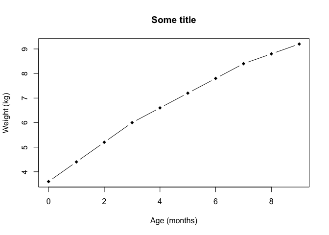
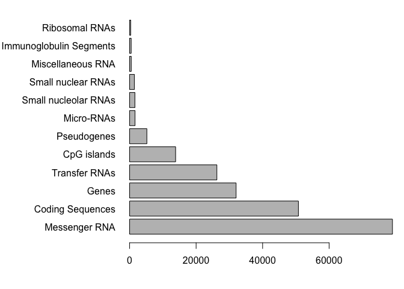
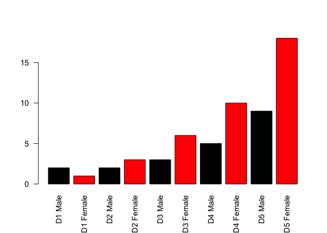
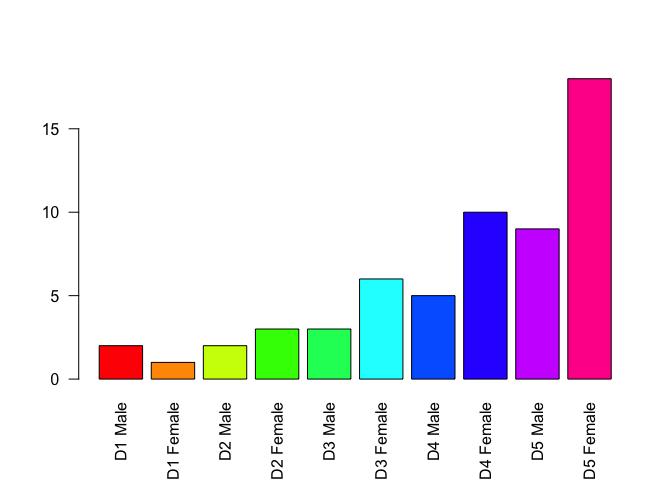

Class 5: R Graphics
================
Gabrielle Blizard
April 16 2019

``` r
# Class 5 R graphics

# 2A. Line plot
weight <- read.table("bimm143_05_rstats/weight_chart.txt", header=TRUE)

plot( weight$Age, weight$Weight, xlab="Age (months)", 
      ylab="Weight (kg)", pch=18,
      typ="b",
      main="Some title")
```



``` r
# 2B. Barplot
feat <- read.table("bimm143_05_rstats/feature_counts.txt", 
                   sep="\t", header=TRUE)

barplot(feat$Count)
```


``` r
# I need to argue with this plot to make it a bit nicer.
barplot(feat$Count, names.arg = feat$Feature, horiz=TRUE, las=1)

# Need to set left side margin to be larger
# Normal par()$mar values
old.par <- par()$mar

par(mar=c(4,11,1,1))
barplot(feat$Count, names.arg = feat$Feature, horiz=TRUE, las=1)
```



``` r
par(mar=old.par)

# Section 3
counts <- read.table("bimm143_05_rstats/male_female_counts.txt", 
                     sep="\t", header=TRUE)

# I could also use the read.delim() function
counts <- read.delim("bimm143_05_rstats/male_female_counts.txt")

barplot(counts$Count, names.arg = counts$Sample, las=2,
        col=c("red","blue") )
```


``` r
# Try different plots

barplot(counts$Count, names.arg = counts$Sample, las=2,
        col=rainbow(10) )
```


``` r
barplot(counts$Count, names.arg = counts$Sample, las=2,
        col=c(1,2) )
```



``` r
barplot(counts$Count, names.arg = counts$Sample, las=2,
        col=rainbow(10) )
```


